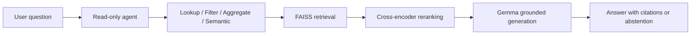

# AI & Deep Learning — Course Project Portfolio

[](https://github.com/Ouriel91)
[](https://www.python.org/)
[](https://colab.research.google.com/)

This repository brings together the projects I completed during the **AI & Deep Learning program by Google and Reichman University**.

The program was organized into four project-based capsules:

1. **Machine Learning & Deep Learning**
2. **Computer Vision**
3. **Natural Language Processing**
4. **Reinforcement Learning**

An additional enrichment capsule introduced broader topics, tools and current directions in applied AI.

The repository is organized by project. Each project directory contains the relevant notebooks and documentation, and the two team projects also include their presentation and short academic report.

---

## Projects at a Glance

| # | Area | Project | Main Topics |
|---:|---|---|---|
| 01 | Machine Learning & Deep Learning | [MIMIC-III Mortality Prediction](./project_01_mimic_III) | Tabular medical data, classification, class imbalance, neural networks, evaluation |
| 02 | Computer Vision | [Building Defect Detection](./project_02_mbdd2025) | YOLOv8, transfer learning, fine-tuning, object detection, controlled experimentation |
| 03 | Natural Language Processing | [jiRAG — Jira RAG Assistant](./project_03_jiRAG) | RAG, multilingual retrieval, FAISS, reranking, Gemma, QLoRA, agents, evaluation |
| 04 | Reinforcement Learning | [Tic-Tac-Toe Agents](./project_04_reinforcement_learning) | Monte Carlo, Q-Learning, DQN, Double DQN, exploration, reward design |

> Each project folder is self-contained and includes its own detailed README or documented notebook workflow.

---

## 01 — MIMIC-III Mortality Prediction

The first project explores mortality prediction from structured medical data derived from **MIMIC-III**.

The work includes preprocessing, exploratory analysis, classical machine-learning models, regression tasks and a dense neural network for binary classification. One of the central findings was that overall accuracy hid a clinically important failure: the model performed poorly when identifying patients who actually died.

To address this, the project used **class weighting** and evaluated the model with metrics such as **recall, precision and F1-score**, rather than relying on accuracy alone.

### Key lessons

- Accuracy can be misleading on imbalanced datasets.
- Evaluation metrics must reflect the real cost of each type of error.
- Class weighting can improve attention to an underrepresented target class.
- Model selection should be based on the task objective, not a single headline metric.

### Main tools

`Python` · `Pandas` · `NumPy` · `scikit-learn` · `TensorFlow/Keras` · `Matplotlib` · `Seaborn`

[Open Project 01](./project_01_mimic_III/)

---

## 02 — Building Defect Detection from UAV Images

This team project implements an end-to-end computer-vision pipeline for detecting five categories of building-surface defects in the **MBDD2025** UAV dataset.

The system uses **YOLOv8n**, transfer learning and end-to-end fine-tuning. The workflow covers annotation validation, exploratory analysis, Pascal VOC to YOLO conversion, leakage-safe image-level splitting, training, evaluation and qualitative error analysis.

The baseline closely reproduced the published MBDD2025 benchmark. A controlled experiment then changed one variable — input resolution from **640×640 to 960×960** — while keeping the model, split and training configuration fixed.

### Main result

The higher-resolution model improved:

- Recall by **+0.020**
- mAP@0.5 by **+0.018**
- mAP@0.5:0.95 by **+0.019**
- Crack AP@0.5:0.95 by **+0.020**

The gain came with a **47% increase in GPU inference time**, demonstrating a measurable accuracy–latency trade-off.

### Main tools

`Python` · `PyTorch` · `Ultralytics YOLOv8` · `OpenCV` · `Pandas` · `Matplotlib` · `Google Colab`

### Deliverables

- Complete Colab notebook
- Detailed project README
- Experimental figures and results
- Presentation
- Short academic report

[Open Project 02](./project_02_mbdd2025)

---

## 03 — jiRAG: Grounded Jira Question Answering

**jiRAG** is an end-to-end Retrieval-Augmented Generation system over a validated corpus of **1,000 anonymized Jira-style tickets**.

The project combines multilingual semantic retrieval, persistent vector search, cross-encoder reranking, grounded generation, QLoRA fine-tuning, a read-only routing agent, incremental Jira synchronization and an interactive Gradio interface.

### Architecture



### Engineering and research highlights

- Multilingual E5 embeddings selected through controlled comparison.
- FAISS retrieval followed by BGE cross-encoder reranking.
- Exact lookup, structured filtering, aggregation, hybrid and semantic routes.
- Gemma 4 generation with QLoRA adapters.
- Explicit citations and abstention when evidence is insufficient.
- Read-only safety boundary for Jira workflow operations.
- Leakage-safe train, validation and frozen-test separation.
- Static research corpus kept separate from the live Jira overlay.
- Controlled **2×2 ablation** of Base/QLoRA and RAG/No-RAG.

### Main conclusion

RAG provided the clearest improvement in grounded answer quality. QLoRA improved several answer-quality metrics, but it was not uniformly better: the base RAG configuration remained safer on unsupported questions and preserved more evidence in the small multi-source test slice. The project therefore treats fine-tuning as a measured trade-off rather than an automatic upgrade.

### Main tools

`Python` · `Gemma 4` · `QLoRA/PEFT` · `Multilingual E5` · `BGE Reranker` · `FAISS` · `Gradio` · `Jira REST API`

### Deliverables

- End-to-end Colab notebook
- Source modules and configuration
- Frozen evaluation corpus and test questions
- Manager-facing Gradio demo
- Presentation
- Academic report

[Open Project 03](./project_03_jiRAG)

---

## 04 — Reinforcement Learning for Tic-Tac-Toe

The final project studies reinforcement-learning agents in a controlled Tic-Tac-Toe environment.

It progresses from tabular methods to deep value-based learning:

- Monte Carlo learning
- Q-Learning
- Deep Q-Networks (DQN)
- Double Deep Q-Networks (DDQN)

The experiments examine learning rate, discount factor, epsilon-based exploration, training duration, reward design and value-estimation behavior. Training behavior is kept separate from evaluation: frozen agents are evaluated greedily against controlled opponents without updating their weights.

### Key lessons

- Exploration behavior during training should not be confused with the learned greedy policy.
- Off-policy Q-learning can learn useful values even when the behavior policy explores heavily.
- Reward design can change the policy in unintended ways.
- DQN and DDQN should be compared under identical seeds, architectures and evaluation conditions.
- DDQN reduces a source of maximization bias, but this does not guarantee better results in every small environment or run.

### Main tools
`Python` · `NumPy` · `TensorFlow/Keras` · `Reinforcement Learning` · `Matplotlib` · `Google Colab`

[Open Project 04](./project_04_reinforcement_learning/)

---

## Shared Engineering Principles

Across the four projects, the emphasis was not only on training models, but on building reproducible and critically evaluated workflows:

- Fixed random seeds and documented configurations
- Clear separation between training, validation and testing
- Leakage prevention and frozen evaluation data
- Baseline comparisons and controlled experiments
- Metrics selected according to the actual task
- Error analysis instead of headline-score reporting alone
- Saved artifacts and resumable Colab workflows
- Explicit limitations and cautious interpretation of results
- Human control over sensitive or irreversible actions

---

## Repository Structure

```text
ai-deep-learning-course/
├── project_01_mimic_III          # MIMIC-III mortality prediction
├── project_02_mbdd2025     # Building defect detection
├── project_03_jiRAG        # Jira RAG assistant
├── project_04_reinforcement_learning          # Tic-Tac-Toe reinforcement learning
└── README.md
```

The exact execution instructions, dependencies and artifact locations are documented inside each project directory.

---

## Running the Projects

Most experiments were designed for **Google Colab** and are provided as Jupyter notebooks.

General workflow:

1. Open the selected project directory.
2. Read its local `README.md` or the introduction in the notebook.
3. Open the notebook in Google Colab.
4. Select the required runtime, including GPU where specified.
5. Configure secrets through Colab Secrets or environment variables — never inside committed code.
6. Run the notebook according to its documented `BUILD / LOAD / RESUME` behavior.

Some training workflows require substantial GPU memory or saved artifacts. Consult the individual project README before using **Run all**.

---

## About This Repository

This repository documents my transition from using AI tools primarily at the application level to understanding and building complete AI workflows — from data preparation and model training to retrieval, agents, controlled evaluation and deployment-oriented interfaces.

It complements my professional background in software development, enterprise applications, integrations and databases.

---

## Author

**Ouriel Ohayon**  
Software Engineer — Enterprise Applications, Data, Integration & Applied AI

- GitHub: [Ouriel91](https://github.com/Ouriel91)
- LinkedIn: [Ouriel Ohayon](https://www.linkedin.com/in/ouriel-ohayon/)

---

## Notes

- The repository is intended as an educational and technical portfolio.
- Medical-project results are experimental and are not intended for clinical use.
- Jira credentials, API tokens, private datasets and trained model artifacts are not committed.
- Large datasets and model weights may need to be downloaded or rebuilt according to the individual project instructions.

